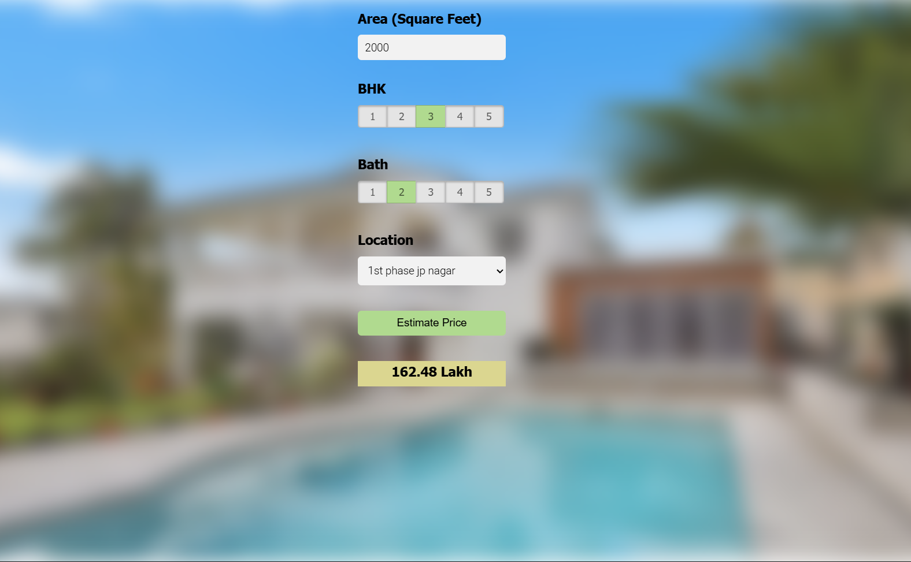
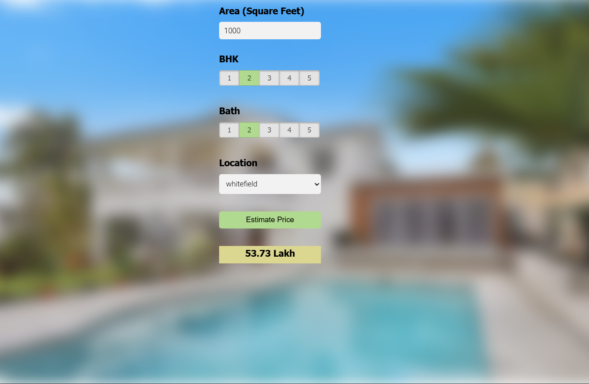
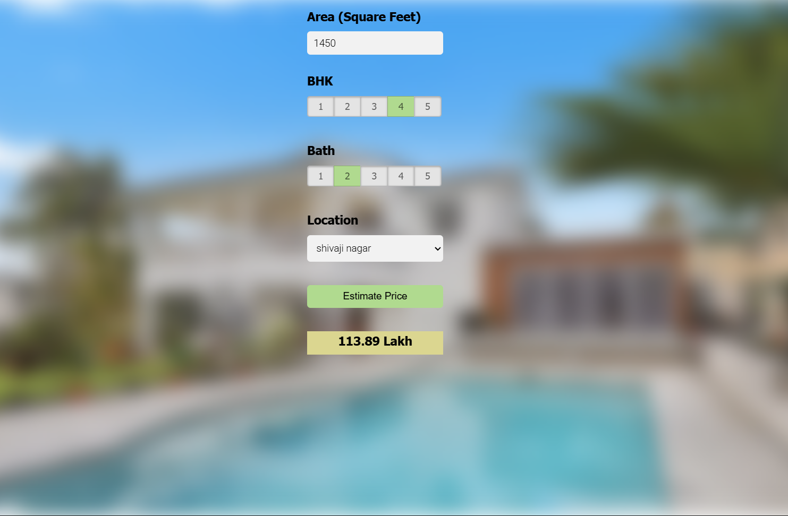

# 🏠 Bengaluru House Price Estimator

A machine learning project that predicts property prices in different Bengaluru localities.  
Users enter house size (sq ft), number of bedrooms 🛏️, bathrooms 🛁, and location 📍, and get an estimated price 💰.

## 🚀 How It Works

- Takes user inputs
- Uses ML model to predict price
- Returns estimated cost for Bengaluru properties

## 🗂️ Project Structure

- `server.py/` — Python backend (Flask)  
- `frontend/` — HTML, CSS, JS files for UI
- `modal/` - Jupyter and Picke File
- `requiremtns.txt` - All the requirements
- `screenshot.png` - Snapshot of working project

## ⚙️ Setup & Run Locally

1. Clone the repo  
2. Create & activate Python virtual environment  
3. Install dependencies: `pip install -r requirements.txt`  
4. Run backend server: `python server.py`  
5. Open `frontend/app.html` in live server or browser

## 🌐 Live Demo

- URL Coming Soon....
- Take a look at Snapshots of working project.

---

Made with 💻 Python, Machine Learning, Flask & Web Tech!  
Feel free to contribute or raise issues. 🙌
